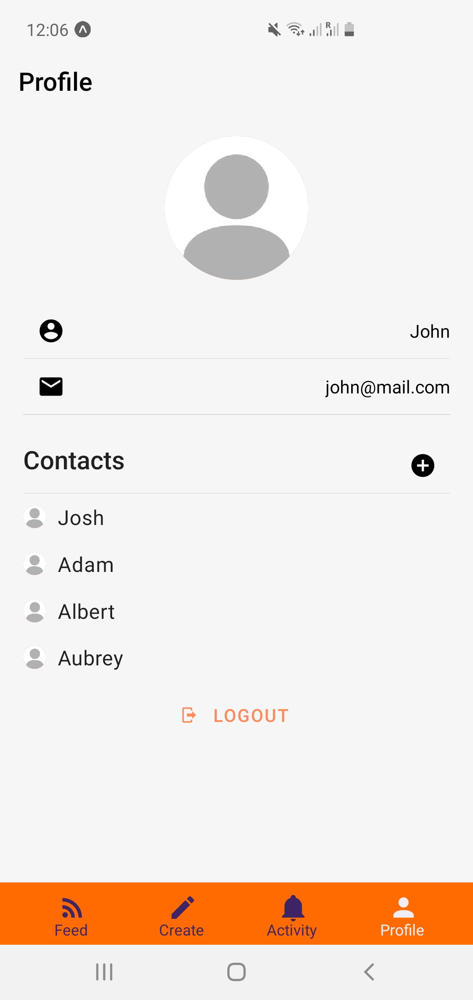
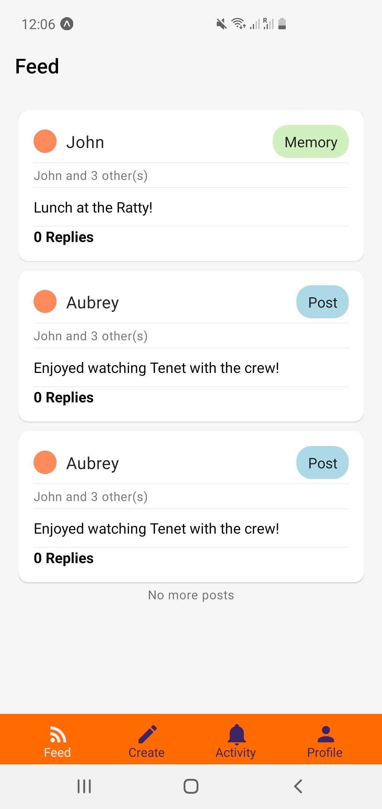
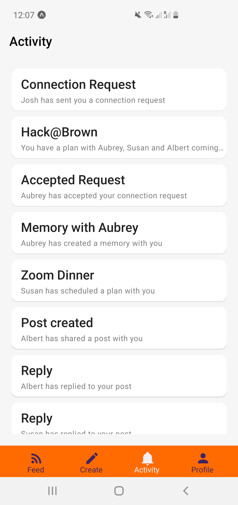
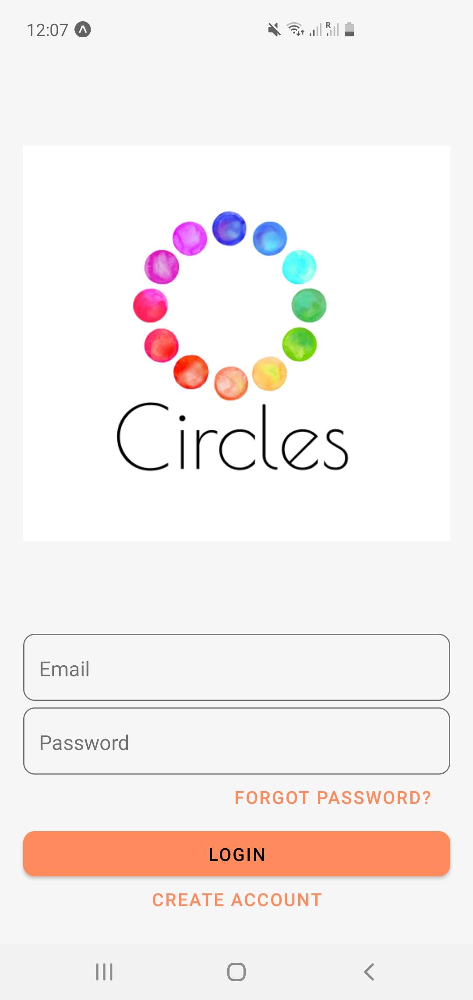
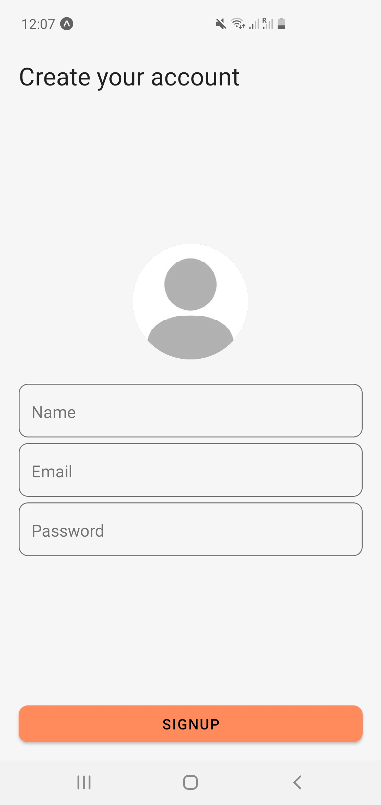

## Inspiration
Studies show that by 2020, 46% of Americans believe that their relationships are not meaningful. In addition, 69% of millennials experience fear of missing out, the most out of any age group. Other negative effects include isolation, cyberbullying, inadequacy and depression, and the COVID-19 is making things worse.

Motivated by the countless studies that highlight social media’s negative effects on the mental health of users, we want to create an alternative to today’s social networking platforms. We’re building a social platform for users who want to avoid the toxicity present on many other platforms and instead focus on forming meaningful, long-term relationships with others. The purpose of Circles is to guide you away from obsessions over likes and reactions and focus on building deeper bonds through encouraging shared experiences and coordinated plans.

## What it does
We want our platform’s users to interact through sharing intimate memories and experiences, as opposed to hollow posts made to garner a large number of likes/upvotes/reactions. We also want our users to be able to easily make plans with others.

Our platform will not display the number of connections one has - we value quality of relationships over quantity of relationships! Additionally, you will be reminded to make plans with users who you have not interacted with for a long period of time. This encourages users to only add others whom they plan to remain connected with and to regularly keep in contact with their current connections by adding them to posts, plans, and memories.

What makes us most different from other social media platforms is that all posts, plans, and memories are private; the user making the post gets to decide which connections or group of connections get to see the post. The user’s feed will only contain posts that have been shared with them, and viewing a user’s profile only shows posts including both the user and the viewer. This prevents users from stalking others and from experiencing the fear of missing out when they scroll through others’ feeds.

## How we built it
Frontend: React Native

Backend: Node, Express, Google App Engine

Database: Google Datastore

## Challenges we ran into
We could not finish some of the features (e.g. updating profile, profile pictures) due to time constraints. However, we implemented the main features (e.g. privacy-protecting posts, plans, and memories) that we make our social platform unique.

## Accomplishments that we're proud of
We’re proud that we were able to create a functioning social media platform, from scratch, in just a day (and night)!

## What we learned
We learned a ton about using Google Cloud Platform - specifically App Engine and Datastore. Heres what each of our members learned:

Aubrey (frontend): Using React Native for the first time to develop a mobile app

Albert (frontend): Using React Native for the first time to develop a mobile app

Joshua (both): Linking frontend and backend using requests, creating RESTful API framework

Adam (backend): Using Google Cloud Platform for the first time, using NoSQL for the first time (Datastore), deploying Node.js servers on App Engine

## What's next for Circles
Our next step is to finish the features we couldn’t finish (e.g. updating profile, profile pictures), refine the user interface, and add notifications.

# Screenshots

